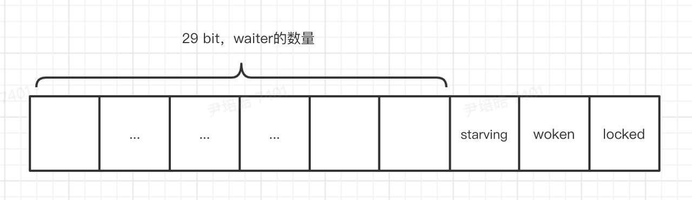

# sync.Mutex
## 互斥锁
互斥锁是对资源的互斥访问机制。在多线程环境下，防止多个线程同时访问公共数据。
```go
	// Mutex fairness.
	//
	// Mutex can be in 2 modes of operations: normal and starvation.
	// In normal mode waiters are queued in FIFO order, but a woken up waiter
	// does not own the mutex and competes with new arriving goroutines over
	// the ownership. New arriving goroutines have an advantage -- they are
	// already running on CPU and there can be lots of them, so a woken up
	// waiter has good chances of losing. In such case it is queued at front
	// of the wait queue. If a waiter fails to acquire the mutex for more than 1ms,
	// it switches mutex to the starvation mode.
	//
	// In starvation mode ownership of the mutex is directly handed off from
	// the unlocking goroutine to the waiter at the front of the queue.
	// New arriving goroutines don't try to acquire the mutex even if it appears
	// to be unlocked, and don't try to spin. Instead they queue themselves at
	// the tail of the wait queue.
	//
	// If a waiter receives ownership of the mutex and sees that either
	// (1) it is the last waiter in the queue, or (2) it waited for less than 1 ms,
	// it switches mutex back to normal operation mode.
	//
	// Normal mode has considerably better performance as a goroutine can acquire
	// a mutex several times in a row even if there are blocked waiters.
	// Starvation mode is important to prevent pathological cases of tail latency.
	// 公平的互斥锁
	//
	// mutex有两种运行模式：正常模式和饥饿模式
	// 在正常模式下，请求锁的goroutine以FIFO的顺序排队依次被唤醒，但是被唤醒的goroutine不能获得锁，而是
	// 与新请求锁的goroutine争夺锁的所有权。新请求锁的goroutine有更大的优势--- 他们已经在cpu运行并且数量
	// 较多，因此被唤醒的goroutine获取失败，将它插入队列头部。
	// 如果一个goroutine超过1s未获取到锁，将会转换为饥饿模式。
	//
	// 在饥饿模式下，互斥锁的所有权直接从解锁的goroutine转移到队首的goroutine。
	// 并且 新到达的goroutine不能尝试获得互斥锁。而是将goroutine插入队列尾部。
	//
	// 如果一个等待的goroutine获得了锁的所有权并且
	// 1) 位于队列尾部 
	// or
	// 2) 等待少于1ms
	// 互斥锁将会切换回饥饿模式
	//
	// 正常模式具有更好的性能，因为一个goroutine可以在排队前通过自旋的方式获得锁。
	// 饥饿模式可以避免尾部延迟的case。
	
```
数据结构
```go
// A Mutex is a mutual exclusion lock.
// The zero value for a Mutex is an unlocked mutex.
//  0值是开启状态的互斥锁
// A Mutex must not be copied after first use.
// 禁止拷贝
type Mutex struct {
    state int32     // mutex的状态，二进制低3位对应锁的状态，state右移3位表示mutex的数量
    sema  uint32    // 信号量，用来唤醒goroutine
}
```
关键常量
```go
const (
	mutexLocked = 1 << iota // mutex is locked 加锁状态
	mutexWoken  // 是否有goroutine被唤醒 or 新请求锁的goroutine
	mutexStarving   // 当前锁处于饥饿状态
	mutexWaiterShift = iota        // waiter的数量：mutex.state>>mutexWaiterShift
	starvationThresholdNs = 1e6 // 当goroutine等待这么久时，互斥锁转换成饥饿模式。写死1ms
)
```
接口
```go
// A Locker represents an object that can be locked and unlocked.
type Locker interface {
	Lock()
	Unlock()
}
```

源码解析
```go
// Lock locks m.
// If the lock is already in use, the calling goroutine
// blocks until the mutex is available.
func (m *Mutex) Lock() {
	// Fast path: 1.使用了atomic包的cas操作，如果互斥锁的state=0(locked,锁处于开启状态且无等待者)，可以直接加锁成功
	if atomic.CompareAndSwapInt32(&m.state, 0, mutexLocked) {
		if race.Enabled {
			race.Acquire(unsafe.Pointer(m))
		}
		return
	}
	// Slow path:2. 核心操作
	m.lockSlow()
}
// mutex的私有方法
func (m *Mutex) lockSlow() {
	var waitStartTime int64 // 当前goroutine的等待时间
	starving := false   // 当前goroutine是否饥饿
	awoke := false  // 当前goroutine是否被唤醒
	iter := 0   // 当前goroutine的自旋次数
	old := m.state  // 当前自旋锁的状态
	for {
		// 饥饿模式的锁不自旋，可以直接转移到队首的goroutine
		// so we won't be able to acquire the mutex anyway.
		// if 当前互斥锁已上锁&&互斥锁处于非饥饿模式&&当前goroutine可以自旋 
		// 当前goroutine进行自旋操作
		if old&(mutexLocked|mutexStarving) == mutexLocked && runtime_canSpin(iter) {
			// Active spinning makes sense.
			// Try to set mutexWoken flag to inform Unlock
			// to not wake other blocked goroutines.
			// if 
			//      当前goroutine没有被唤醒&&
			//      互斥锁没有被唤醒&&
			//      waiter的数量不等于0&&
			// 那就将当前状态设置为唤醒，锁的状态也设置为唤醒，解锁时就不用去唤醒阻塞的goroutine
			if !awoke && old&mutexWoken == 0 && old>>mutexWaiterShift != 0 &&
				atomic.CompareAndSwapInt32(&m.state, old, old|mutexWoken) {
				awoke = true
			}
			runtime_doSpin()
			iter++
			old = m.state
			continue
		}
		// new是对互斥锁期望状态的设置
		new := old
		// Don't try to acquire starving mutex, new arriving goroutines must queue.
		// 1. mutex处于非锁定状态
		// 2. mutex处于饥饿状态
		// 3. goroutine已经不能自旋
		
		// 锁不是饥饿状态，那么期望状态改为加锁
		if old&mutexStarving == 0 {
			new |= mutexLocked
		}
		// 锁处于锁定状态或饥饿模式，当前goroutine进入队列，等待数量+1
		if old&(mutexLocked|mutexStarving) != 0 {
			new += 1 << mutexWaiterShift
		}
		// 当前goroutine已经处于饥饿状态
		// 如果互斥锁没有锁定，不需要转换为饥饿模式
		// Unlock操作希望互斥锁有waiter
		if starving && old&mutexLocked != 0 {
			new |= mutexStarving
		}
		// 互斥锁被唤醒
		if awoke {
			// The goroutine has been woken from sleep,
			// so we need to reset the flag in either case.
			if new&mutexWoken == 0 {
				throw("sync: inconsistent mutex state")
			}
			new &^= mutexWoken
		}
		// 开始自旋操作，自旋失败需要重新开始循环
		if atomic.CompareAndSwapInt32(&m.state, old, new) {
			if old&(mutexLocked|mutexStarving) == 0 {
				break // locked the mutex with CAS
			}
			// If we were already waiting before, queue at the front of the queue.
			// wait时间不为0 说明之前已经被唤醒过，需要把goroutine放在等待队列队首
			queueLifo := waitStartTime != 0
			// 设置初始时间戳
			if waitStartTime == 0 {
				waitStartTime = runtime_nanotime()
			}
			// goroutine进入sleep，使用信号量来获取锁
			runtime_SemacquireMutex(&m.sema, queueLifo, 1)
			// 如果等待时间超过1ms 将当前goroutine标记为饥饿状态
			starving = starving || runtime_nanotime()-waitStartTime > starvationThresholdNs
			old = m.state
			// 锁处于饥饿状态
			if old&mutexStarving != 0 {
				// If this goroutine was woken and mutex is in starvation mode,
				// ownership was handed off to us but mutex is in somewhat
				// inconsistent state: mutexLocked is not set and we are still
				// accounted as waiter. Fix that.
				// 锁的状态为解锁态
				if old&(mutexLocked|mutexWoken) != 0 || old>>mutexWaiterShift == 0 {
					throw("sync: inconsistent mutex state")
				}
				// 当前goroutine已经获取锁，waiter-1 状态更新为锁定
				delta := int32(mutexLocked - 1<<mutexWaiterShift)
				if !starving || old>>mutexWaiterShift == 1 {
					// Exit starvation mode.
					// Critical to do it here and consider wait time.
					// Starvation mode is so inefficient, that two goroutines
					// can go lock-step infinitely once they switch mutex
					// to starvation mode.
					delta -= mutexStarving  
				}
				atomic.AddInt32(&m.state, delta)
				break
			}
			awoke = true
			iter = 0    // 自旋清零
		} else {
			old = m.state
		}
	}

	if race.Enabled {
		race.Acquire(unsafe.Pointer(m))
	}
}

```
Unlock
```go
// Unlock unlocks m.
// It is a run-time error if m is not locked on entry to Unlock.
//
// A locked Mutex is not associated with a particular goroutine.
// It is allowed for one goroutine to lock a Mutex and then
// arrange for another goroutine to unlock it.
func (m *Mutex) Unlock() {
	if race.Enabled {
		_ = m.state
		race.Release(unsafe.Pointer(m))
	}

	// Fast path: drop lock bit.
	// 无waiter且处于正常模式，直接unlock
	new := atomic.AddInt32(&m.state, -mutexLocked)
	if new != 0 {
		// Outlined slow path to allow inlining the fast path.
		// To hide unlockSlow during tracing we skip one extra frame when tracing GoUnblock.
		m.unlockSlow(new)
	}
}
func (m *Mutex) unlockSlow(new int32) {
    if (new+mutexLocked)&mutexLocked == 0 {
        throw("sync: unlock of unlocked mutex")
    }
	// mutex处于正常模式
    if new&mutexStarving == 0 {
        old := new
        for {
// If there are no waiters or a goroutine has already
// been woken or grabbed the lock, no need to wake anyone.
// In starvation mode ownership is directly handed off from unlocking
// goroutine to the next waiter. We are not part of this chain,
// since we did not observe mutexStarving when we unlocked the mutex above.
// So get off the way.
			// 1. 没有waiter在等待
			// 2。mutex已经被其他goroutine获取
			// 3。 goroutine处于唤醒状态
			// 4。 锁处于饥饿模式（mutex的所有权直接转移到下一个waiter
			// 直接返回
            if old>>mutexWaiterShift == 0 || old&(mutexLocked|mutexWoken|mutexStarving) != 0 {
                return
			}
// Grab the right to wake someone.
            // 此时锁为空闲态，处于正常模式，没有waiter被唤醒
            new = (old - 1<<mutexWaiterShift) | mutexWoken
            if atomic.CompareAndSwapInt32(&m.state, old, new) {
				// 唤醒队首waiter
                runtime_Semrelease(&m.sema, false, 1)
                return
            }
            old = m.state
		}
    } else {
// Starving mode: handoff mutex ownership to the next waiter, and yield
// our time slice so that the next waiter can start to run immediately.
// Note: mutexLocked is not set, the waiter will set it after wakeup.
// But mutex is still considered locked if mutexStarving is set,
// so new coming goroutines won't acquire it.
    runtime_Semrelease(&m.sema, true, 1)
    }
}

```
https://www.bilibili.com/video/BV1BT4y1e7W7?spm_id_from=333.337.search-card.all.click&vd_source=71ccc22ec8e1f453ddccbeabb1a50437  
https://www.golangroadmap.com/question_bank/golang.html#%E5%88%B7%E9%A2%98%E8%AE%B0%E5%BD%95