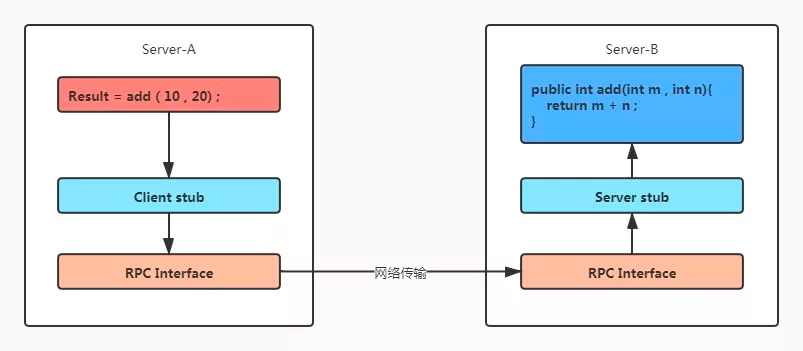

hertz提供HTTP框架，自动化生成模版。

# RPC
对于远程调用的通用方法：在Server_B封装一个接口，通过服务暴露方法，如通过Http请求，Server_A就可
以调用Server_B的方法。  
虽然可以实现，但是每次调用时都需要发送http请求。使用HTTP协议，远程调用对于请求头但内容依赖不强，
body使用二进制编码，header使用文本编码 ，占用字节数，增加传输负担。因此需要引入RPC协议精简
数据， 自定义 TCP报文。所以希望可以有一种方法，向调用本地一样发起远程调用。
## RPC过程

* 服务调用方（client 调用 以本地调用方式调用服务
* Client Stub将方法名、参数组装成消息体，序列化后找到服务地址，将消息发送给服务端。
* Server Stub收到消息后，反序列化，得到调用信息，调用本地服务。
* 本地服务执行，返回结果给Server Stub
* Server Stub打包结果，序列化发给调用方。
* Client Stub接收消息后反序列化，调用方最终得到结果。
归根结底，是本地调用，只不过调用信息和调用结果远程发送。  
而RPC框架屏蔽了底层细节，如消息的序列化和反序列化、网络传输协议的细节。
## RPC的优势
#### 与HTTP
虽然HTTP和RPC都是处于应用层，但是将应用层细分后，RPC所处位置高于HTTP，HTTP是网络传输协议，
而RPC可以看作是一种编程模式或实现方案， 通常包含传输协议和序列化协议等，可以使用HTTP来实现
RPC，但处于效率考虑，一般使用TCP传输数据。
#### 与Restful风格的API
RPC是面向过程的，GET用来查询信息，而其他情况下一律POST请求  
而Restful风格面向资源，是一种具体的存在。GET/POST/PUT/DELETE，对应了增删改查，请求参数是名词。
# quick start
* `go install github.com/cloudwego/hertz/cmd/hz@latest`  
* `hz new` 
```shell
- biz
  - handler
    - ping.go
  - router
    - register.go
- .hz
- go.mod
- main.go
- router.go
- router_gen.go
```
* `go mod tidy`  
* 在main.go中加入代码
```go
func main() {
	h := server.Default()

	register(h)
	h.GET("/ping",func(c context.Context,ctx *app.RequestContext){
		ctx.JSON(consts.StatusOK,utils.H{"ping":"pong"})
	})
	h.Spin()
}
```
* `go build -o herzStart && ./herzStart`
```shell
2022/09/18 17:38:38.063254 engine.go:548: [Debug] HERTZ: Method=GET    absolutePath=/ping                     --> handlerName=main.main.func1 (num=2 handlers)
2022/09/18 17:38:38.063753 transport.go:91: [Info] HERTZ: HTTP server listening on address=[::]:8888
```
* `curl http://127.0.0.1:8888/ping`
`{"ping":"pong"}% `
此时，hertz server的启动和调用已经完成。


# 参考
https://melonshell.github.io/2020/01/25/tech4_rpc/  
https://www.cloudwego.io/zh/docs/hertz/getting-started/  

